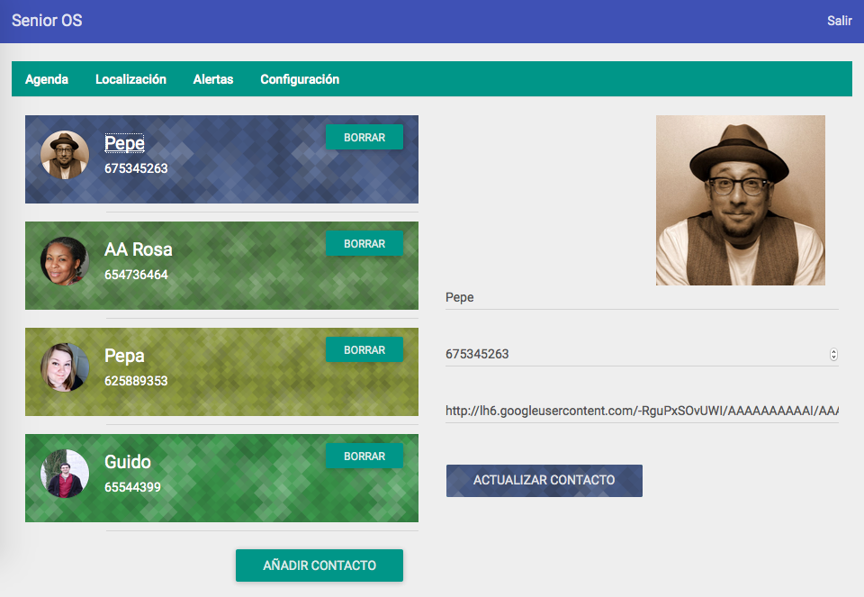
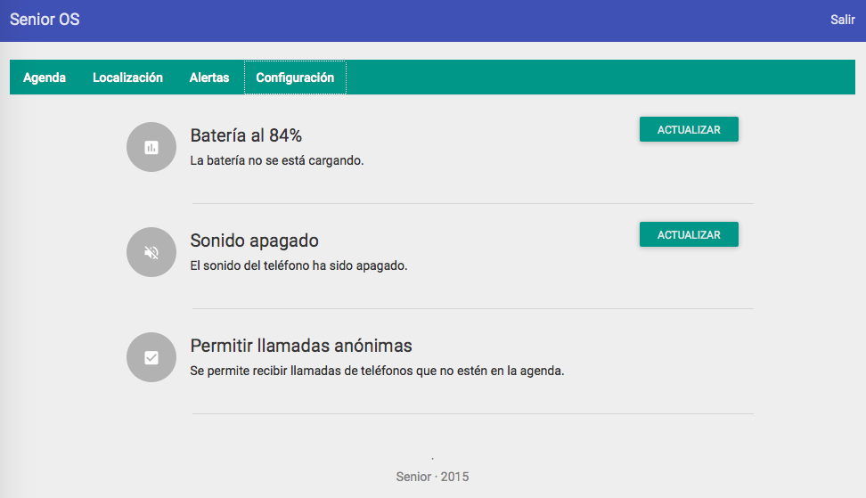
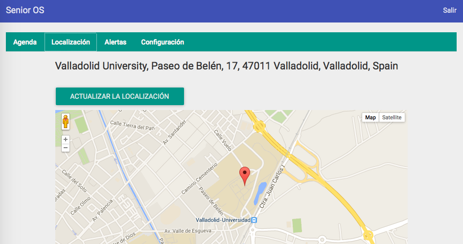

# Senior OS

## Instalación

Prerequisitos: nodejs 0.10+, mongodb 2.4+, bower.

```
$ git clone
$ bower install
$ npm install
$ npm start
```

Navega a [localhost:2200](http://localhost:2200).

## Screenshots






